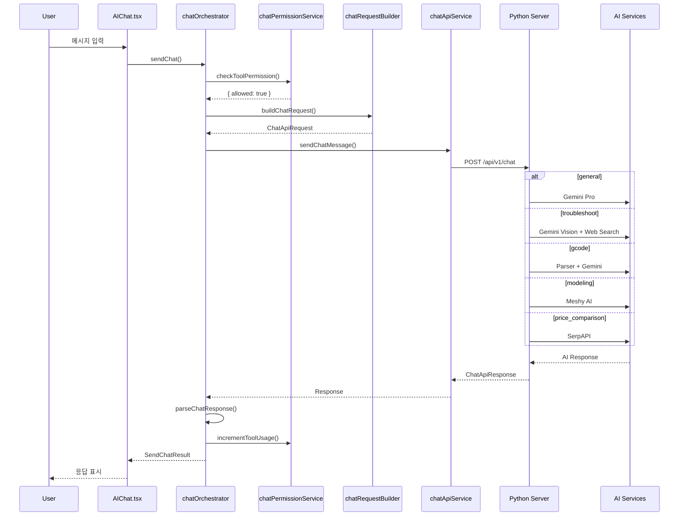

# FACTOR HIBRID AI 도구 상세 문서

## 목차

1. [AI 도구 개요](#1-ai-도구-개요)
2. [일반 채팅 (general)](#2-일반-채팅-general)
3. [문제 진단 (troubleshoot)](#3-문제-진단-troubleshoot)
4. [G-code 분석 (gcode)](#4-g-code-분석-gcode)
5. [AI 모델 생성 (modeling)](#5-ai-모델-생성-modeling)
6. [문제 해결 (resolve_issue)](#6-문제-해결-resolve_issue)
7. [가격 비교 (price_comparison)](#7-가격-비교-price_comparison)
8. [권한 및 사용량 관리](#8-권한-및-사용량-관리)
9. [아키텍처 및 데이터 플로우](#9-아키텍처-및-데이터-플로우)

---

## 1. AI 도구 개요

### 도구 타입 정의

```typescript
type ChatTool =
  | 'general'          // 일반 채팅
  | 'troubleshoot'     // 문제 진단
  | 'gcode'            // G-code 분석
  | 'modeling'         // AI 모델 생성
  | 'resolve_issue'    // G-code 이슈 해결
  | 'price_comparison' // 가격 비교
```

### 도구별 요약

| 도구 | 설명 | AI 엔진 | 권한 |
|------|------|---------|------|
| `general` | 3D 프린팅 관련 일반 질문 답변 | Gemini Pro | 익명 10회/일, 로그인 무제한 |
| `troubleshoot` | 프린터 문제 진단 및 해결 방안 | Gemini Pro Vision + 웹 검색 | Free 5회/일, Paid 무제한 |
| `gcode` | G-code 파일 분석 및 품질 평가 | 자체 파서 + Gemini | 로그인 필요 |
| `modeling` | Text-to-3D, Image-to-3D 생성 | Meshy AI | Free 1회/월, Starter 10회/월, Pro 무제한 |
| `resolve_issue` | G-code 이슈 자동 수정 | Gemini Pro | 로그인 필요 |
| `price_comparison` | 3D 프린팅 제품 가격 비교 | SerpAPI + Gemini | 로그인 필요 |

### 파일 구조

```
packages/
├── web/src/
│   ├── features/ai-chat/
│   │   ├── types/
│   │   │   └── chat.types.ts        # 타입 정의
│   │   ├── services/
│   │   │   ├── chatOrchestrator.ts  # 메인 오케스트레이터
│   │   │   ├── chatRequestBuilder.ts # 요청 빌더
│   │   │   ├── chatResponseParser.ts # 응답 파서
│   │   │   └── chatPermissionService.ts # 권한 서비스
│   │   └── hooks/
│   │       ├── useChatComposer.ts   # 입력 컴포저
│   │       ├── useChatPermissions.ts # 권한 훅
│   │       └── useGcodeController.ts # G-code 컨트롤러
│   └── pages/
│       └── AIChat.tsx               # 메인 페이지
└── shared/src/
    └── services/
        ├── chatApiService.ts        # API 통신
        └── aiService.ts             # AI 서비스 (3D 모델링)
```

---

## 2. 일반 채팅 (general)

### 개요

3D 프린팅 관련 일반적인 질문에 대한 답변을 제공합니다.

### 기능
- 3D 프린터 사용법 안내
- 필라멘트 종류 및 특성 설명
- 출력 설정 권장값 제공
- 프린팅 팁 및 가이드
- 대화 컨텍스트 유지 (최근 15개 메시지)

### API 요청

```typescript
interface GeneralChatRequest {
  message: string;
  selected_tool: null;  // 자동 감지
  selected_model: string;
  user_id?: string;
  user_plan: 'free' | 'starter' | 'pro' | 'enterprise';
  language: 'ko' | 'en';
  conversation_id?: string;
  conversation_history?: Array<{
    role: 'user' | 'assistant';
    content: string;
  }>;
}
```

### 사용 예시

```typescript
const result = await sendChat({
  tool: null,  // 또는 'general'
  message: 'PLA와 PETG의 차이점이 뭐야?',
  files: { images: [], gcodeFile: null },
  context: {
    userId: user?.id,
    userPlan: 'free',
    language: 'ko',
    conversationHistory: [...],
  },
  selectedModel: 'gemini-1.5-flash',
});
```

### 응답 형식

```typescript
interface GeneralChatResponse {
  response: string;           // 마크다운 형식 응답
  intent: 'general';
  confidence: number;         // 0-1
  suggested_actions?: Array<{
    label: string;
    action: string;
    data: Record<string, unknown>;
  }>;
}
```

---

## 3. 문제 진단 (troubleshoot)

### 개요

프린터 문제를 진단하고 해결 방안을 제시합니다. 이미지 분석과 웹 검색을 통해 정확한 진단을 제공합니다.

### 기능
- **이미지 분석**: 출력물 사진을 분석하여 문제 식별
- **증상 기반 진단**: 텍스트 설명으로 문제 파악
- **해결 방안 제시**: 단계별 해결 가이드
- **참조 이미지 제공**: 유사 문제 예시 이미지
- **전문가 의견**: 예방 팁 및 추가 조언

### API 요청

```typescript
interface TroubleshootRequest {
  message: string;
  selected_tool: 'troubleshoot';
  attachments?: Array<{
    type: 'image';
    content: string;        // Base64
    filename: string;
    mime_type: string;
  }>;
  printer_info?: {
    manufacturer?: string;
    model?: string;
    nozzle_diameter?: number;
  };
  language: 'ko' | 'en';
}
```

### 응답 형식

```typescript
interface TroubleshootResponse {
  response: string;           // 마크다운 형식 진단 결과
  intent: 'troubleshoot';
  tool_result: {
    tool_name: 'troubleshoot';
    success: boolean;
    data: {
      problem?: {
        type: string;         // 'stringing', 'layer_adhesion', etc.
        confidence: number;   // 0-1
        description: string;
      };
      solutions?: Array<{
        title: string;
        steps: string[];
        difficulty: 'easy' | 'medium' | 'hard' | 'expert';
        estimated_time: string;
        source_refs?: Array<{
          title: string;
          url: string;
          source?: string;
        }>;
      }>;
      expert_opinion?: {
        summary: string;
        prevention_tips: string[];
        source_refs?: Array<{...}>;
      };
    };
  };
  references?: Array<{        // 웹 검색 참고 자료
    title: string;
    url: string;
    source?: string;
    snippet?: string;
  }>;
  reference_images?: {        // 참조 이미지
    search_query?: string;
    total_count?: number;
    images: Array<{
      title: string;
      thumbnail_url: string;
      source_url: string;
      width?: number;
      height?: number;
    }>;
  };
}
```

### 문제 유형

| 문제 코드 | 설명 | 일반적 원인 |
|----------|------|-------------|
| `stringing` | 스트링잉 (실타래) | 리트랙션 부족, 온도 과열 |
| `layer_adhesion` | 층간 접착 불량 | 온도 낮음, 속도 빠름 |
| `warping` | 휘어짐 | 베드 온도 낮음, 접착 불량 |
| `elephant_foot` | 코끼리발 | 첫 레이어 높음, 베드 온도 높음 |
| `under_extrusion` | 압출 부족 | 노즐 막힘, 필라멘트 문제 |
| `over_extrusion` | 과압출 | 플로우 높음 |
| `bed_adhesion` | 베드 접착 불량 | 레벨링 불량, 베드 오염 |
| `z_banding` | Z축 밴딩 | 리드스크류 문제, 진동 |

### 사용 예시

```typescript
// 이미지와 함께 진단 요청
const images = await filesToBase64(imageFiles);

const result = await sendChat({
  tool: 'troubleshoot',
  message: '출력물에 실같은 것이 많이 생겨요',
  files: { images: imageFiles, gcodeFile: null },
  context: {
    userId: user.id,
    userPlan: 'starter',
    language: 'ko',
  },
  selectedModel: 'gemini-1.5-pro',
});
```

---

## 4. G-code 분석 (gcode)

### 개요

G-code 파일을 분석하여 품질 점수, 예상 출력 시간, 문제점 등을 제공합니다.

### 기능
- **파일 파싱**: 레이어별 세그먼트 분석
- **품질 점수**: 0-100점 품질 평가
- **예상 시간**: 출력 예상 시간 계산
- **이슈 감지**: 잠재적 문제점 식별
- **통계 정보**: 필라멘트 사용량, 온도 설정 등
- **SSE 스트리밍**: 실시간 분석 진행률

### API 요청

```typescript
interface GcodeAnalysisRequest {
  message: string;
  selected_tool: 'gcode';
  attachments: [{
    type: 'gcode';
    content: string;        // Base64
    filename: string;
  }];
  language: 'ko' | 'en';
}
```

### 응답 형식

```typescript
interface GcodeAnalysisResponse {
  response: string;
  intent: 'gcode_analysis';
  analysis_id: string;        // 분석 ID
  stream_url?: string;        // SSE 스트림 URL
  segments?: {                // 즉시 반환되는 세그먼트
    layers: Array<{
      layer_number: number;
      z_height: number;
      commands: string[];
      extrusion_mm: number;
    }>;
    metadata: {
      layerCount: number;
      totalLines: number;
      fileSize: number;
    };
  };
  tool_result: {
    tool_name: 'gcode_analysis';
    success: boolean;
    data: {
      analysis_id: string;
      status: 'segments_ready' | 'analyzing' | 'completed';
      filename: string;
      quality_score?: number;
      summary?: {
        print_time: {
          formatted: string;
          seconds: number;
        };
        filament: {
          total_extrusion_mm: number;
          retraction_count: number;
        };
        layers: {
          total_layers: number;
          layer_height_mm: number;
          first_layer_height_mm: number;
        };
        temperature: {
          nozzle: { max: number; min: number; avg: number; };
          bed: { max: number; min: number; avg: number; };
        };
        speed: {
          print_speed_avg: number;
          travel_speed_avg: number;
        };
      };
      issues?: Array<{
        issue_id: string;
        type: string;
        title: string;
        message: string;
        severity: 'critical' | 'high' | 'medium' | 'low' | 'warning' | 'info';
        line?: number;
        lines?: number[];
      }>;
    };
  };
}
```

### 이슈 타입

| 이슈 타입 | 심각도 | 설명 |
|----------|--------|------|
| `missing_start_gcode` | critical | 시작 G-code 없음 |
| `missing_end_gcode` | high | 종료 G-code 없음 |
| `excessive_retraction` | medium | 과도한 리트랙션 |
| `high_speed_warning` | medium | 속도 과다 |
| `temperature_inconsistency` | warning | 온도 불일치 |
| `z_hop_excessive` | low | Z-hop 과다 |

### 분석 플로우

```
1. 파일 업로드
   ↓
2. 즉시 세그먼트 파싱 (segments_ready)
   ↓
3. SSE 스트리밍 시작
   ↓
4. LLM 분석 진행 (analyzing)
   ├── 레이어 분석
   ├── 이슈 감지
   └── 품질 점수 계산
   ↓
5. 분석 완료 (completed)
   ↓
6. 보고서 생성
```

### SSE 이벤트

```typescript
// SSE 이벤트 타입
type SSEEvent =
  | { type: 'progress'; data: { percent: number; message: string; } }
  | { type: 'issue'; data: GcodeIssue }
  | { type: 'complete'; data: GcodeAnalysisData }
  | { type: 'error'; data: { message: string; } }
```

### 사용 예시

```typescript
// G-code 파일 분석
const result = await sendChat({
  tool: 'gcode',
  message: '이 출력 파일 확인해줘',
  files: { images: [], gcodeFile: gcodeFile },
  context: {
    userId: user.id,
    userPlan: 'pro',
    language: 'ko',
  },
  selectedModel: 'gemini-1.5-flash',
});

// SSE 스트리밍 연결
if (result.result?.analysisId) {
  const eventSource = new EventSource(
    `${API_URL}/api/v1/gcode/stream/${result.result.analysisId}`
  );

  eventSource.onmessage = (event) => {
    const data = JSON.parse(event.data);
    updateProgress(data);
  };
}
```

---

## 5. AI 모델 생성 (modeling)

### 개요

텍스트 프롬프트나 이미지를 기반으로 3D 프린팅용 모델을 생성합니다.

### 기능
- **Text-to-3D**: 텍스트 설명으로 3D 모델 생성
- **Image-to-3D**: 이미지를 3D 모델로 변환
- **출력 형식**: GLB, STL 파일 제공
- **썸네일 생성**: 미리보기 이미지
- **프린팅 최적화**: 출력 가능한 메쉬 생성

### 모델링 옵션

```typescript
interface ModelingOptions {
  symmetry_mode: 'off' | 'auto' | 'on';
  art_style: 'realistic' | 'sculpture';
  target_polycount: number;  // 기본 30000
}
```

### API 요청 (Text-to-3D)

```typescript
interface TextTo3DRequest {
  message: string;            // 모델 설명 프롬프트
  selected_tool: 'modelling';
  selected_model: string;
  user_id: string;
  // 내부적으로 3D 프린팅 최적화 프롬프트 추가
}
```

### API 요청 (Image-to-3D)

```typescript
interface ImageTo3DRequest {
  message: string;
  selected_tool: 'modelling';
  attachments: [{
    type: 'image';
    content: string;          // Base64
    filename: string;
    mime_type: string;
  }];
}
```

### 응답 형식

```typescript
interface ModelingResponse {
  response: string;
  intent: 'modelling_text' | 'modelling_image';
  tool_result: {
    tool_name: string;
    success: boolean;
    data: {
      task_id: string;
      model_id: string;
      status: 'processing' | 'completed' | 'failed';
      prompt: string;
      glb_url: string | null;
      stl_url: string | null;
      thumbnail_url: string | null;
      // 완료 시 추가 정보
      glb_download_url?: string;
      stl_download_url?: string;
      thumbnail_download_url?: string;
      dimensions?: {
        x: number;
        y: number;
        z: number;
      };
    };
  };
}
```

### 3D 프린팅 최적화 프롬프트

```typescript
const BASE_3D_PRINT_PROMPT = `3D-printable model requirements:
- Solid, watertight mesh (no hollow areas or holes)
- Stable base, overhangs below 45°
- Minimum wall thickness 2mm
- No thin spikes or fragile details
- Clean surface, no self-intersections
- Single unified object`;

function buildPrintablePrompt(userPrompt: string): string {
  return `${userPrompt}\n\n${BASE_3D_PRINT_PROMPT}`;
}
```

### 생성 플로우

```
1. 프롬프트 입력 (텍스트/이미지)
   ↓
2. Meshy AI 요청 (async_mode=true)
   ↓
3. task_id 수신
   ↓
4. 진행률 폴링 (5초 간격)
   ├── PENDING (0%)
   ├── PROCESSING (10-90%)
   └── SUCCEEDED (100%)
   ↓
5. GLB → STL 변환
   ↓
6. 파일 저장 (Python 서버)
   ↓
7. Supabase Storage 업로드
   ↓
8. DB 레코드 생성 (ai_generated_models)
```

### MQTT 알림

```typescript
// 완료 알림 (ai/model/completed/{user_id})
interface AIModelCompletedPayload {
  model_id: string;
  status: 'completed';
  download_url: string;
  thumbnail_url?: string;
  stl_download_url?: string;
  model_name: string;
  generation_type: 'text_to_3d' | 'image_to_3d';
}

// 진행률 알림 (ai/model/progress/{user_id})
interface AIModelProgressPayload {
  model_id: string;
  status: 'processing';
  progress: number;  // 0-100
  message: string;
}
```

### 사용 예시

```typescript
// Text-to-3D
const result = await sendChat({
  tool: 'modeling',
  message: '귀여운 로봇 피규어',
  files: { images: [], gcodeFile: null },
  context: {
    userId: user.id,
    userPlan: 'pro',
    language: 'ko',
  },
  selectedModel: 'gemini-1.5-flash',
});

// 진행률 폴링
if (result.result?.taskId) {
  const finalResult = await pollTaskUntilComplete(
    result.result.taskId,
    (progress, status) => {
      console.log(`Progress: ${progress}% - ${status}`);
    }
  );
}
```

---

## 6. 문제 해결 (resolve_issue)

### 개요

G-code 분석에서 발견된 이슈를 자동으로 수정합니다.

### 기능
- **이슈별 수정**: 특정 이슈에 대한 코드 수정
- **라인별 패치**: 문제 라인 식별 및 수정 코드 제공
- **적용/되돌리기**: 수정 적용 및 롤백

### API 요청

```typescript
interface ResolveIssueRequest {
  message: string;
  selected_tool: 'resolve_issue';
  analysis_id: string;
  issue_to_resolve: {
    issue_id: string;
    title: string;
    severity: 'critical' | 'high' | 'medium' | 'low' | 'warning' | 'info';
    description?: string;
    line?: number;
    lines?: number[];
  };
}
```

### 응답 형식

```typescript
interface ResolveIssueResponse {
  response: string;           // 수정 설명
  intent: 'resolve_issue';
  tool_result: {
    tool_name: 'resolve_issue';
    success: boolean;
    data: {
      issue_id: string;
      fixes: Array<{
        line_number: number;
        original: string;
        fixed: string;
        description?: string;
      }>;
    };
  };
}
```

### 사용 예시

```typescript
// 이슈 해결 요청
const result = await resolveGcodeIssue({
  analysisId: 'analysis-123',
  issue: {
    issue_id: 'issue-456',
    title: 'Excessive Retraction',
    severity: 'medium',
    description: 'Retraction distance too high',
    line: 1234,
  },
  context: {
    userId: user.id,
    userPlan: 'pro',
    language: 'ko',
    conversationHistory: [],
  },
});

// 에디터에서 패치 적용
if (result.success && result.result?.codeFixes) {
  applyFixes(result.result.codeFixes);
}
```

---

## 7. 가격 비교 (price_comparison)

### 개요

3D 프린터 관련 제품의 가격을 비교하여 구매 링크와 함께 제공합니다.

### 기능
- **가격 검색**: 여러 마켓플레이스 검색
- **가격 정렬**: 가격순, 평점순 정렬
- **필터링**: 카테고리, 가격대, 재고 필터
- **구매 링크**: 상품 페이지 직접 링크

### API 요청

```typescript
interface PriceComparisonRequest {
  message: string;            // 검색 쿼리
  selected_tool: 'price_comparison';
  price_comparison_options?: {
    marketplaces?: ('naver' | 'coupang' | 'amazon' | 'ebay')[];
    min_price?: number;
    max_price?: number;
    sort_by?: 'price_asc' | 'price_desc' | 'rating' | 'review_count';
    max_results?: number;
    category?: '3d_printer' | 'filament' | 'parts' | 'accessories';
    in_stock_only?: boolean;
  };
}
```

### 응답 형식

```typescript
interface PriceComparisonResponse {
  response: string;
  intent: 'price_comparison';
  tool_result: {
    tool_name: 'price_comparison';
    success: boolean;
    data: {
      query: string;
      results_count: number;
      products: Array<{
        id: string;
        title: string;
        price: number;
        currency: string;
        price_krw: number;
        original_price?: number;
        discount_percent?: number;
        marketplace: 'naver' | 'coupang' | 'amazon' | 'ebay';
        product_url: string;
        image_url?: string;
        rating?: number;
        review_count?: number;
        in_stock: boolean;
      }>;
      markets_searched: string[];
    };
  };
}
```

### 사용 예시

```typescript
const result = await sendChat({
  tool: 'price_comparison',
  message: 'PLA 필라멘트 1kg 가격 비교해줘',
  files: { images: [], gcodeFile: null },
  context: {
    userId: user.id,
    userPlan: 'starter',
    language: 'ko',
    conversationHistory: [],
  },
  selectedModel: 'gemini-1.5-flash',
});

// 결과 표시
if (result.result?.priceComparisonData) {
  displayProducts(result.result.priceComparisonData.products);
}
```

---

## 8. 권한 및 사용량 관리

### 플랜별 제한

| 플랜 | 일반 채팅 | 문제 진단 | G-code 분석 | AI 모델 생성 | 가격 비교 |
|------|----------|----------|-------------|--------------|----------|
| 익명 | 10회/일 | 10회/일 | X | X | X |
| Free | 무제한 | 5회/일 | 무제한 | 1회/월 | 무제한 |
| Starter | 무제한 | 무제한 | 무제한 | 10회/월 | 무제한 |
| Pro | 무제한 | 무제한 | 무제한 | 무제한 | 무제한 |

### 권한 체크 서비스

```typescript
// 도구별 권한 체크
async function checkToolPermission(
  tool: ChatTool | null,
  userId: string | undefined,
  userPlan: string | undefined
): Promise<PermissionResult> {
  // 익명 사용자 기본 체크
  if (!userId) {
    const anonCheck = checkAnonymousPermission();
    if (!anonCheck.allowed) return anonCheck;
  }

  // 도구별 추가 체크
  switch (tool) {
    case 'troubleshoot':
      if (userId) return checkTroubleshootPermission(userId);
      break;
    case 'modeling':
      return checkModelingPermission(userId, userPlan);
    default:
      break;
  }

  return { allowed: true };
}
```

### 익명 사용자 관리

```typescript
// localStorage 기반 익명 사용량 추적
const ANON_USAGE_KEY = 'factor_anon_usage';
const ANON_DAILY_LIMIT = 10;

function checkAnonymousUsage(): { canUse: boolean; used: number; limit: number; } {
  const today = new Date().toISOString().split('T')[0];
  const stored = localStorage.getItem(ANON_USAGE_KEY);
  const usage = stored ? JSON.parse(stored) : { date: today, count: 0 };

  // 날짜가 바뀌면 리셋
  if (usage.date !== today) {
    return { canUse: true, used: 0, limit: ANON_DAILY_LIMIT };
  }

  return {
    canUse: usage.count < ANON_DAILY_LIMIT,
    used: usage.count,
    limit: ANON_DAILY_LIMIT,
  };
}

function incrementAnonymousUsage(): void {
  const today = new Date().toISOString().split('T')[0];
  const stored = localStorage.getItem(ANON_USAGE_KEY);
  const usage = stored ? JSON.parse(stored) : { date: today, count: 0 };

  if (usage.date !== today) {
    usage.date = today;
    usage.count = 0;
  }

  usage.count++;
  localStorage.setItem(ANON_USAGE_KEY, JSON.stringify(usage));
}
```

### 사용량 증가

```typescript
async function incrementToolUsage(
  tool: ChatTool | null,
  userId: string | undefined,
  isFallback: boolean = false
): Promise<void> {
  // 서버 연결 실패(fallback) 시 차감 안함
  if (isFallback) return;

  // 익명 사용자
  if (!userId) {
    incrementAnonymousUsage();
    return;
  }

  // 도구별 사용량 증가
  switch (tool) {
    case 'modeling':
      await incrementUsage(userId, USAGE_TYPES.AI_MODEL_GENERATION);
      break;
    case 'troubleshoot':
      await incrementTroubleshootAdvancedUsage(userId);
      break;
    default:
      break;
  }
}
```

---

## 9. 아키텍처 및 데이터 플로우

### 전체 아키텍처

```
┌─────────────────────────────────────────────────────────────────┐
│                        AIChat.tsx (UI Layer)                     │
├─────────────────────────────────────────────────────────────────┤
│  ┌──────────────┐  ┌──────────────┐  ┌──────────────┐          │
│  │ useChatComposer │ useChatMessages │ useChatSessions │        │
│  └──────────────┘  └──────────────┘  └──────────────┘          │
├─────────────────────────────────────────────────────────────────┤
│                    chatOrchestrator.ts (Business Logic)          │
│  ┌──────────────────────────────────────────────────────────┐  │
│  │ 1. checkToolPermission()                                   │  │
│  │ 2. buildChatRequest()                                      │  │
│  │ 3. sendChatMessage() → API 호출                            │  │
│  │ 4. parseChatResponse()                                     │  │
│  │ 5. incrementToolUsage()                                    │  │
│  └──────────────────────────────────────────────────────────┘  │
├─────────────────────────────────────────────────────────────────┤
│                    chatApiService.ts (API Layer)                 │
│  ┌──────────────────────────────────────────────────────────┐  │
│  │ POST /api/v1/chat                                          │  │
│  │ - 도구별 라우팅                                             │  │
│  │ - Fallback 응답 생성                                        │  │
│  └──────────────────────────────────────────────────────────┘  │
├─────────────────────────────────────────────────────────────────┤
│                    Python AI Server                              │
│  ┌────────────┐  ┌────────────┐  ┌────────────┐               │
│  │  Gemini    │  │  Meshy AI  │  │  SerpAPI   │               │
│  │  (LLM)     │  │  (3D)      │  │  (Search)  │               │
│  └────────────┘  └────────────┘  └────────────┘               │
└─────────────────────────────────────────────────────────────────┘
```

### 메시지 전송 플로우



### 데이터베이스 테이블

```sql
-- 채팅 세션
CREATE TABLE chat_sessions (
  id UUID PRIMARY KEY,
  user_id UUID REFERENCES auth.users,
  title TEXT,
  tool_type TEXT,  -- 'general', 'troubleshoot', 'gcode', etc.
  created_at TIMESTAMP DEFAULT NOW()
);

-- 채팅 메시지
CREATE TABLE chat_messages (
  id UUID PRIMARY KEY,
  session_id UUID REFERENCES chat_sessions,
  user_id UUID REFERENCES auth.users,
  type TEXT,  -- 'user', 'assistant'
  content TEXT,
  images TEXT[],
  metadata JSONB,  -- referenceImages, priceComparisonData, etc.
  created_at TIMESTAMP DEFAULT NOW()
);

-- AI 생성 모델
CREATE TABLE ai_generated_models (
  id UUID PRIMARY KEY,
  user_id UUID REFERENCES auth.users,
  generation_type TEXT,  -- 'text_to_3d', 'image_to_3d'
  prompt TEXT,
  glb_url TEXT,
  stl_url TEXT,
  thumbnail_url TEXT,
  meshy_task_id TEXT,
  status TEXT,
  created_at TIMESTAMP DEFAULT NOW()
);

-- G-code 분석 보고서
CREATE TABLE gcode_analysis_reports (
  id UUID PRIMARY KEY,
  user_id UUID REFERENCES auth.users,
  analysis_id TEXT UNIQUE,
  file_name TEXT,
  quality_score INTEGER,
  report_data JSONB,
  created_at TIMESTAMP DEFAULT NOW()
);

-- 사용량 추적
CREATE TABLE user_usage (
  id UUID PRIMARY KEY,
  user_id UUID REFERENCES auth.users,
  usage_type TEXT,  -- 'ai_model_generation', 'troubleshoot_advanced'
  count INTEGER DEFAULT 0,
  period_start TIMESTAMP,
  period_end TIMESTAMP
);
```
